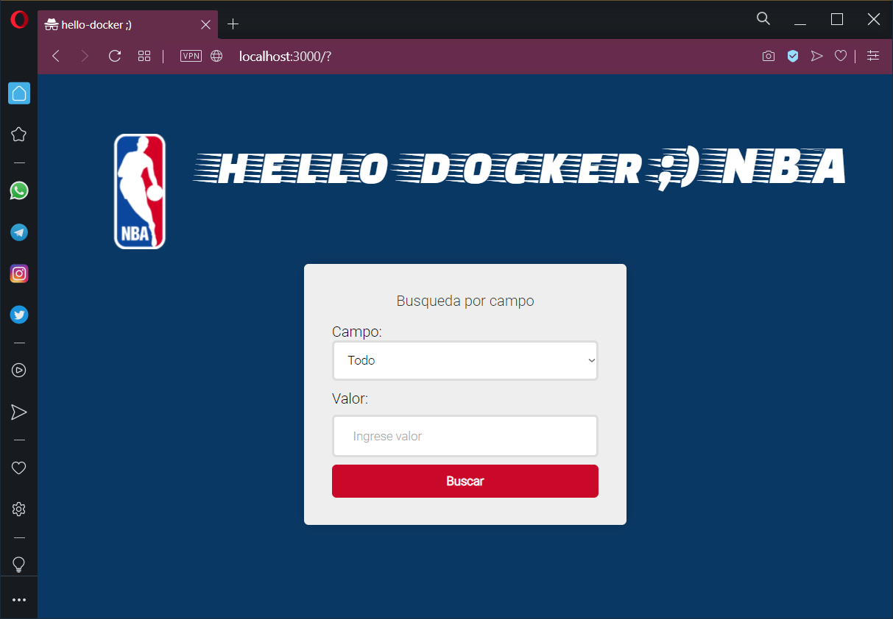
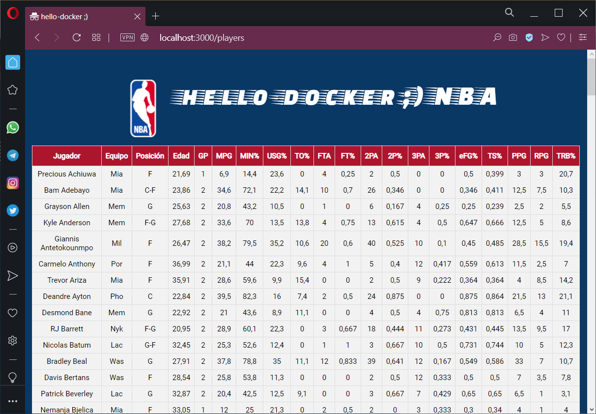
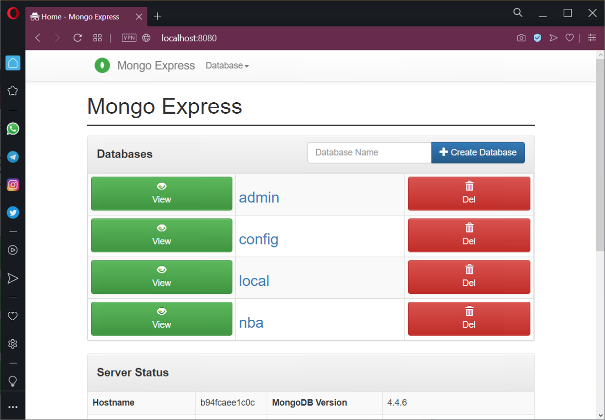

# hello-docker

Template basico para generar imagenes docker utilizando git actions y subiendolas al docker hub.  

La pagina web se monta sobre nodejs, se crea una base de datos mongodb con información de estadisticas de la nba. Se crea un volumen persistente para que no se pierdan los datos.

Utilizado:
- [X] node.js
- [X] mongodb
- [X] mongo-express
- [X] docker image
- [X] docker compose
- [X] docker hub
- [X] docker volume
- [X] docker network
- [X] github actions
- [X] github package
 

## Pagina web






## Ejecución

Para ejecutar solo hay que correr el archivo docker compose y listo.  

#### start
```docker
docker-compose -f "docker-compose.yaml" up -d
```

#### stop
```docker
docker-compose -f "docker-compose.yaml" down
```

#### browser mongo-express
```
http:\\localhost:8080
```
  


#### browser web page
```
http:\\localhost:3000
```

#### browser mongodb
```
http:\\localhost:27017
```

## Log

v1: imagen docker con pagina node.js, inicializacion de db en mongodb con datos de estadisticas de jugadores de nba. Archivo docker-compose listo para ejecutar.  

v2: se mejoro la web para realizar busquedas por campos. Se deja lista la imagen docker.  


## Comentarios
- Cualquier cosa me avisan!!! Estoy en linea ;)